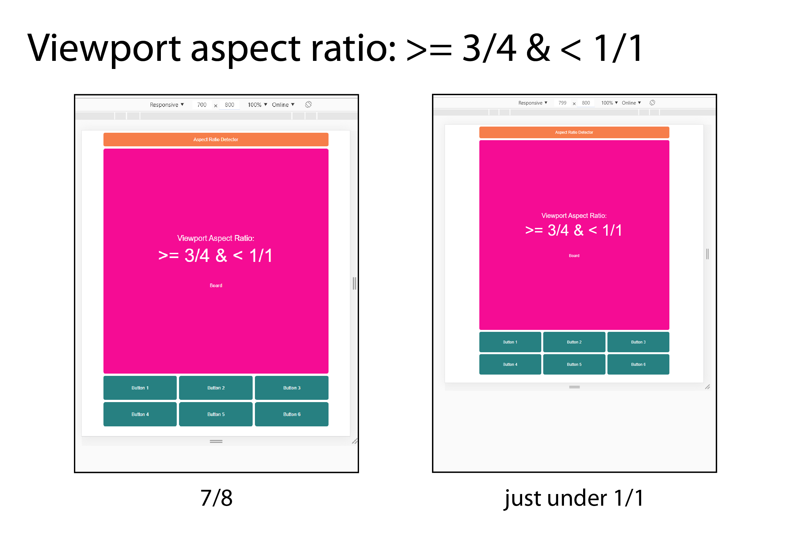
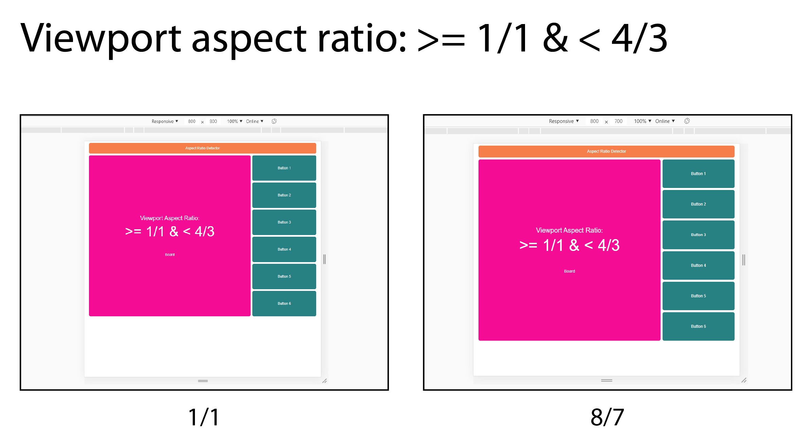
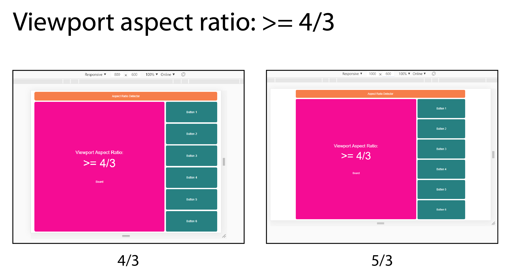

# Aspect-Ratio-Detector

## Try it on [CodeSandbox](https://codesandbox.io/s/github/ChristopherJFoster/Aspect-Ratio-Detector).

### It's easier to resize the app when it's in [its own window](https://h7n89.csb.app).

In this project I'm exploring using media queries to detect and respond to aspect ratio **and** viewport/screen size (not just the latter). Designing for different viewport widths (I'll use 'viewport' to mean 'viewport/screen') is perhaps a bit simpler, and it obviously works pretty well for scrollable material like paragraphs of text or a series of images. However, there are cases where some elements (perhaps the primary elements) of an app need to be visible at all times. Furthermore, we might want those elements to be as large as possible based on the available screen real estate.

A few of my projects are implementations of games ([Conway's Life](https://github.com/ChristopherJFoster/Conways-Life) and a version of [Battleship](<https://en.wikipedia.org/wiki/Battleship_(game)>) called Sandwich Hunter (in development)). In both cases we need to display a board component and a controls component, and they both need to be visible at all times. My implementation of Life features a square grid, and Battleship already uses square grids, so I'm going to use a square board component in this project.

In this article I'll be discussing the aspect ratios (ARs) of both the viewport **and** the app itself - essential how best to have the latter respond to the former.

## Project goals:

1. Title, Board, and Controls components are always fully visible.
2. App AR is always roughly 3/4 or 4/3. These two ratios cover most use cases while requiring the user to be familiar with at most two app layouts.
3. Title component runs full width of app.
4. Board component is as large as possible while accounting for 2 & 3.
5. Controls component is as large as possible while accounting for 2, 3, & 4.
6. Do not ask users to adjust their viewport to accomodate the app.

Note that it's quite possible to meet some goals while only querying viewport width. One would begin by choosing either the 3/4 or 4/3 layout for the app, and then choose one of the following options:

- Ask the user to resize their browser window or reorient their device to better fit the app. This accomplishes goals 1-5 while obviously failing to accomplish goal 6. In some cases it's not possible for a user to adjust the viewport. Furthermore, reshaping the viewport to fit the app clearly doesn't maximize the use of available screen area anyway (see '3/4 app on a 16/9 monitor' in the image below).
- Accept that AR mismatches will result in large amounts of unused space. This accomplishes goals 1-3 and 6 while failing to accomplish goals 4 and 5.


With a combination of aspect ratio media queries and responsiveness to viewport width and height, however, we can achieve all six goals in one design. Below I'll explain my approach to this particular use case, which you can hopefully generalize to other cases.

## The Aspect Ratio Media Query

The [aspect ratio media query](https://developer.mozilla.org/en-US/docs/Web/CSS/@media/aspect-ratio) expects for its value a [ratio](https://developer.mozilla.org/en-US/docs/Web/CSS/ratio) in the form of width/height - where both width and height are positive, unitless integers. Similar to the more commonly used _width_ media query, an AR media query works with either a min, max, or exact value. For example, to apply CSS styles at exactly a 3/4 AR, we'd use something like:

```css
@media (aspect-ratio: 3/4) {
  background: chartreuse;
}
```

Note that even though 3/4 = 0.75, supplying 0.75 as the AR is invalid CSS syntax. Note also that if you're using [less](http://lesscss.org/), the compiler will unhelpfully turn that 3/4 into 0.75. The [workaround](https://github.com/less/less.js/issues/3225) is to escape the ratio like so:

```css
@media (aspect-ratio: ~'3/4') {
  background: chartreuse;
}
```

For this project I'm not interested in exact ARs, but in setting up ranges. Specifically, I want the design to respond to ARs in the following four ranges:

1. < 3/4
2. 3/4 >= & < 1/1
3. 1/1 >= & < 4/3
4. \> 4/3

After some research and tinkering, I learned that the above can be accomplished, simply enough, with the following media queries:

```css
@media (max-aspect-ratio: ~'3/4') {
  [CSS here...]
}
@media (min-aspect-ratio: ~'3/4') and (max-aspect-ratio: ~'1/1') {
  [CSS here, too...]
}
@media (min-aspect-ratio: ~'1/1') and (max-aspect-ratio: ~'4/3') {
  [CSS here, also...]
}
@media (min-aspect-ratio: ~'4/3') {
  [CSS here, as well...]
}
```

If you've noticed that in the code above multiple rules apply when the AR is _exactly_ 3/4, 1/1, or 4/3, then good for you for paying attention. If you caught that, then you may already know that CSS rules are applied in order, and that the last rule (in the last stylesheet, if the rule appears in multiple stylesheets) will prevail. Thus an exact 3/4 AR would have the second set of rules applied, an exact 1/1 would have the third set of rules applied, and so on. Note that this means you should be careful if you use overlapping aspect ratio media queries in multiple places in your CSS. In most cases, I imagine, you'd want to make sure that your ranges of ARs are in the same order each time you use them.

So now we can apply CSS rules selectively based on the detected AR of the viewport. This alone is a useful feature to understand, but it isn't enough to meet all six goals outlined earlier - we still need to the app to respond to viewport size.

## Responsiveness to either viewport width _or_ height

Since I'm aiming for the board and controls components to be as large as possible given the viewport size and aspect ratio (goals 4 & 5)—while maintaining a 1/1 aspect ratio for the board component—I'm going to have get to my hands dirty with careful calculations and responsive units for each AR range.

### Viewport aspect ratio: < 3/4 range

I'll start with the `< 3/4` range. In this project the App component is the container for the other components, and I set its width and height based first on the AR of the viewport. For `< 3/4`, I use the following code (`display: grid` and the `grid-area` assignments are not shown):

```css
@media (max-aspect-ratio: ~'3/4') {
  width: 100vw;
  height: 130vw;
  grid-template-columns: 1fr 98fr 1fr;
  grid-template-rows: 1fr 6fr 1fr 98fr 1fr 22fr 1fr;
  grid-template-areas:
    '. . .'
    '. title .'
    '. . .'
    '. board .'
    '. . .'
    '. controls .'
    '. . .';
}
```

From: [src/less/App.less](https://github.com/ChristopherJFoster/Aspect-Ratio-Detector/blob/master/src/less/App.less)

`vw`, if you're not familiar, is a [CSS viewport unit](https://developer.mozilla.org/en-US/docs/Web/CSS/length) corresponding to 1% of the width of the viewport. 100vw, therefore, sets the width to 100% of the width of the viewport, while 130vw sets the height to 130% of the width of the viewport. Together, these style the App container component to have (roughly) a 3/4 AR that is as large as possible based on the viewport width (true 3/4 would have a height of 133.333...vw. I rounded to 130 to make it easier to distribute the available space to the subcomponents and to avoid the inexact rendering borne of a repeating decimal).


> So far so good: at a 5/8 ratio there is unused space, but given that the board component must be square, it can't be any larger than it is. Since one of app's ARs is ~3/4, it naturally fills most of the viewport when the viewport's AR is ~3/4.

### Viewport aspect ratio: >= 3/4 & < 1/1

The next range covers cases where the AR of the viewport is greater than 3/4 but less than 1/1. That is, the viewport is a rectangle that is taller than it is wide. The AR of the app, given the options of ~3/4 or ~4/3, should still be ~3/4. So how would we set the width and height of the App container component to be ~3/4 AR while using as much of the viewport as possible? Like so:

```css
@media (min-aspect-ratio: ~'3/4') and (max-aspect-ratio: ~'1/1') {
  width: 75vh;
  height: 97.5vh;
  grid-template-columns: 1fr 98fr 1fr;
  grid-template-rows: 1fr 6fr 1fr 98fr 1fr 22fr 1fr;
  grid-template-areas:
    '. . .'
    '. title .'
    '. . .'
    '. board .'
    '. . .'
    '. controls .'
    '. . .';
}
```

From: [src/less/App.less](https://github.com/ChristopherJFoster/Aspect-Ratio-Detector/blob/master/src/less/App.less)

The first thing to note is that we're now using `vh` units, which is a unit equal to 1% of the viewport's _height_. The second thing to note is that the ratio between width and height (75 to 97.5) is the same as it was previously (100 to 130), which makes sense because in this viewport AR range we still want the app's AR to be ~3/4. But why have we switched from viewport _width_ units to viewport _height_ units? The practical answer is that I experimented with a number of configurations, and `vh` units acheive the effect that I want. After some analysis, however, we can see that when the app is in the >= 3/4 & < 1/1 AR range, viewport height is the limiting factor for the size of the app, and thus we use `vh` units to set the size of the App container. If this is not yet clear, you might try [playing with the viewport AR](https://h7n89.csb.app).

After setting the size and shape of the App container for this AR range, we can use the same CSS grid styling as the previous AR range (since we want the same ~3/4 AR for the app itself). There are clever ways to avoid repeating the grid styling, but in a case like this I prefer explicit over clever.



> As in the previous AR range, we can see that while there is some unused screen area, the app could not be much larger than it is while maintaining a square Board component.

### Viewport aspect ratio: >= 1/1 & < 4/3

We can move a little more quickly through the last two viewport AR ranges since they are similar to the first two, only turned on the side. From here, we'll want the app's AR to switch to ~4/3. As such, we'll want the App container component to be ~4/3. We can do that with the following `width` and `height` values.

```css
@media (min-aspect-ratio: ~'1/1') and (max-aspect-ratio: ~'4/3') {
  width: 97.5vw;
  height: 75vw;
  grid-template-columns: 1fr 91fr 1fr 36fr 1fr;
  grid-template-rows: 1fr 6fr 1fr 91fr 1fr;
  grid-template-areas:
    '. . . . .'
    '. title title title .'
    '. . . . .'
    '. board . controls .'
    '. . . . .';
}
```

From: [src/less/App.less](https://github.com/ChristopherJFoster/Aspect-Ratio-Detector/blob/master/src/less/App.less)

The width and height values are the same as the previous viewport AR range, only reversed (we are, after all, moving from ~3/4 to ~4/3). And since the limiting factor is now the _width_ of the viewport, we've returned to using `vw` units. The only other noteworthy change is that the buttons in the Controls component are now arranged in a 1x6 matrix rather than 3x2. This styling is also accomplished using aspect ratio media queries (see [src/less/Controls.less](https://github.com/ChristopherJFoster/Aspect-Ratio-Detector/blob/master/src/less/Controls.less) for details).



> A square viewport (1/1) isn't ideal for this app, but then again, there are very few, if any, square screens. As with the other AR ranges, the square Board could not be much larger than it is.

### Viewport aspect ratio: >= 4/3

The final viewport AR range is styled using the width and height values from the < 3/4 range, only reversed, and using `vh` units instead of `vw` units:

```css
@media (min-aspect-ratio: ~'4/3') {
  width: 130vh;
  height: 100vh;
  grid-template-columns: 1fr 91fr 1fr 36fr 1fr;
  grid-template-rows: 1fr 6fr 1fr 91fr 1fr;
  grid-template-areas:
    '. . . . .'
    '. title title title .'
    '. . . . .'
    '. board . controls .'
    '. . . . .';
}
```

From: [src/less/App.less](https://github.com/ChristopherJFoster/Aspect-Ratio-Detector/blob/master/src/less/App.less)



> A 4/3 viewport AR is obviously a good fit for the ~4/3 app AR. At a viewport AR of 5/3, the app still uses as much viewport real estate as it can.

## Conclusion / Notes

There is more to know about aspect ratio media queries than I discuss here, but if you're new to them, I hope I've provided a useful introduction. Though the use case I've explored is a bit niche, I think it's simple enough to be easily adapted to other cases. If you've learned something, spotted an error, or if I've saved you a bit of effort in solving a similar puzzle, let me know in the comments.
