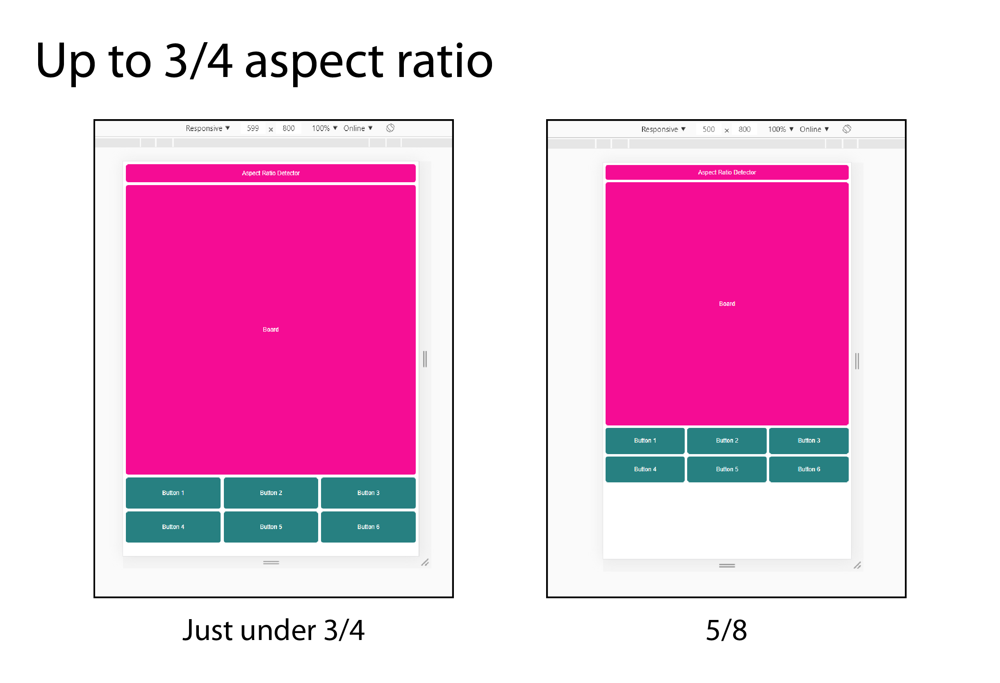

# Aspect-Ratio-Detector

## Try it on [CodeSandbox](https://codesandbox.io/s/github/ChristopherJFoster/Aspect-Ratio-Detector). It's easier to resize the app when it's in [its own window](https://h7n89.csb.app).

In this project I'm exploring using media queries to detect and respond to aspect ratio **and** screen width (not just the latter). Designing for different screen widths is a bit simpler, and it obviously works pretty well for scrollable material like paragraphs of text or a series of images. However, there are cases where some elements (perhaps the primary elements) of an app need to be visible at all times. Furthermore, we might want those elements to be as large as possible based on the available screen real estate.

A few of my projects have been implementations of games ([Conway's Life](https://github.com/ChristopherJFoster/Conways-Life) and a version of [Battleship](<https://en.wikipedia.org/wiki/Battleship_(game)>) called Sandwich Hunter (in development)). In both cases we have a board component and a controls component, and it won't do to force the user to scroll to see one or the other. My implementation of Life features a square grid, and Battleship already uses square grids, so I use a square board component in this project.

## Project goals:

1. Title, Board, and Controls components are always fully visible.
2. App proportions are either 3/4 or 4/3.
   - These two ratios cover most use cases while requiring the user to be familiar with at most two app layouts.
3. Title component runs full width of app.
4. Board component is as large as possible while accounting for 2, 3.
5. Controls component is as large as possible while accounting for 2, 3, 4.
6. Do not ask users to adjust their device or screen to accomodate the app.

Note that it's quite possible to meet some goals while only querying screen width. One would begin by choosing either the 3/4 or 4/3 layout for the app, and then choose one of the following options:

- Ask the user to resize their browser window or reorient their device to better fit your app. This accomplishes goals 1-5 while obviously failing to accomplish goal 6.
- Accept that aspect ratio mismatches will result in large amounts of unused space. This accomplishes goals 1-3 and 6 while failing to accomplish goals 4 and 5.


With a combination of aspect ratio media queries and responsiveness to screen width and height, however, we can achieve all six goals in one design.

## The Aspect Ratio Media Query

The [aspect ratio media query](https://developer.mozilla.org/en-US/docs/Web/CSS/@media/aspect-ratio) works with min, max and exact values, and the value supplied must be in the form of width/height. For example, to apply CSS rules at exactly a 4/3 aspect ratio, we'd use something like:

```css
@media (aspect-ratio: 4/3) {
  background: chartreuse;
}
```

Note that even though 4/3 = 1.25, supplying 1.25 as the aspect ratio is invalid CSS syntax. Note also that if you're using [less](http://lesscss.org/), the compiler will unhelpfully turn that 4/3 into 1.25. The [workaround](https://github.com/less/less.js/issues/3225) is to escape the ratio thusly:

```css
@media (aspect-ratio: ~'4/3') {
  background: chartreuse;
}
```

For this project I'm not interested in exact aspect ratios, but in setting up ranges. Specifically, I wanted the design to respond to aspect ratios in three ranges:

1. up to 3/4
2. from 3/4 to 4/3
3. 4/3 and above

After some research and tinkering, I learned that the above can be accomplished, simply enough, with the following media queries:

```css
@media (max-aspect-ratio: ~'3/4') {
  [css here...]
}
@media (min-aspect-ratio: ~'3/4') and (max-aspect-ratio: ~'4/3') {
  [other css here...]
}
@media (min-aspect-ratio: ~'4/3') {
  [still other css here...]
}
```

If you've noticed that in the code above multiple rules apply when the aspect ratio is _exactly_ 3/4 or 4/3, then good for you for paying attention. If you noticed that, then you may already know that CSS rules are applied in order, and that the last one will prevail. Thus an exact 3/4 aspect ratio would have the second set of rules applied, and an exact 4/3 would have the third set of rules applied. Note that this means you should be careful if you use overlapping aspect ratio media queries in multiple places in your CSS. Make sure that your ranges of aspect ratios are in the same order each time you use them.

So now we can apply CSS rules selectively based on the detected aspect ratio of the viewport/screen. This alone is a useful feature to understand, but it isn't enough to meet all six goals outlined earlier - we still need to the app to respond to screen size.

## Responsiveness to either screen width _or_ height

Since I'm aiming for the board and controls components to be as large as possible given the screen size and aspect ratio (goals 4 & 5)—while maintaining a 1/1 aspect ratio for the board component—I'm going to have get to my hands dirty with careful calculations and responsive units for each aspect ratio range. I'll start with the 'up to 3/4' range. In this project the App component is the container for the other components, and I set its width and height based first on the aspect ratio of viewport/screen. For 'up to 3/4', I used the following code:

```css
width: 100vw;
height: 130vw;
```

"vw", if you're not familiar, is a [CSS viewport unit](https://developer.mozilla.org/en-US/docs/Web/CSS/length) corresponding to 1% of the width of the viewport. 100vw, therefore, sets the width to 100% of the width of the viewport, while 130vw sets the height to 130% of the width of the viewport. Together, these style the App container component to have roughly a 3/4 aspect ratio that is as large as possible based on the viewport width (true 3/4 would have a height of 133.333...vw. I rounded to 130 to make it easier to distribute the available space to the subcomponents).



> So far so good: at a 5/8 ratio there is unused space, but given that the board component must be square, it can't be any larger than it is.

Next we have the middle range - from 3/4 to 4/3.

...

## Conclusion / Notes

There is probably more to know about aspect ratio media queries than I discuss here. My main aim, however, was to meet the goals I described above, and to document the process. If you're reading this and you're not me, I hope you've learned something, and that maybe I've saved you a bit of effort in solving a similar puzzle.
