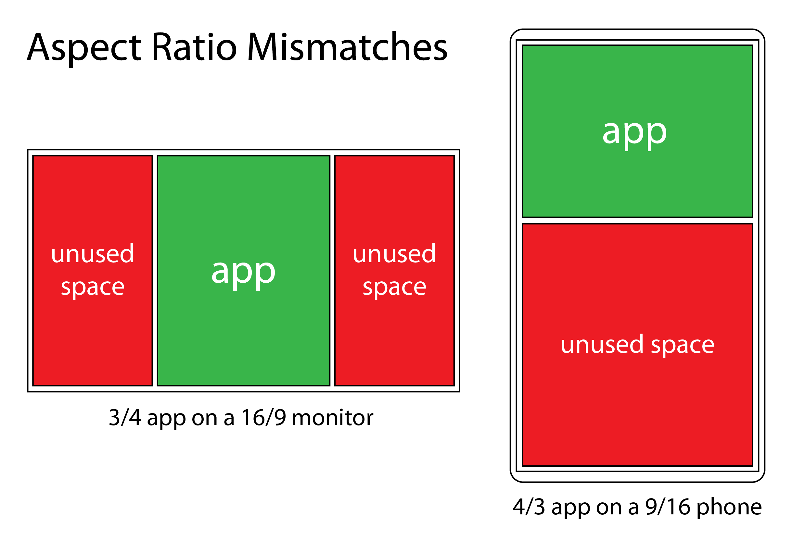
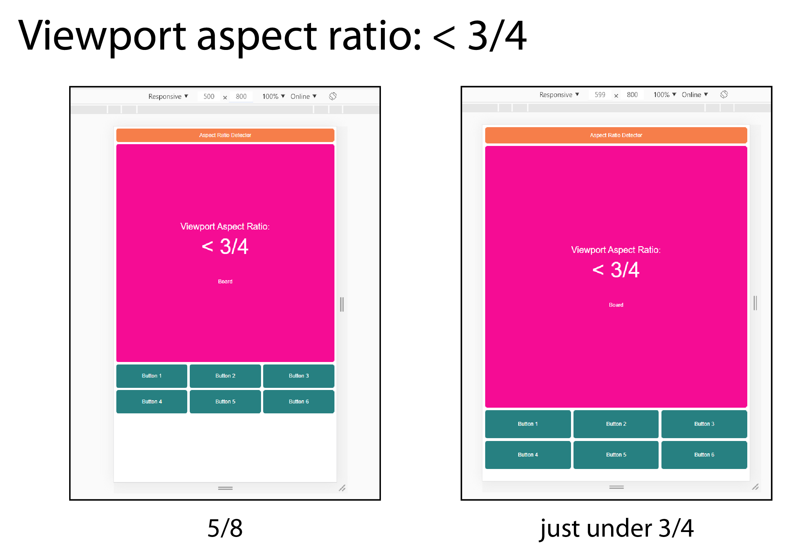
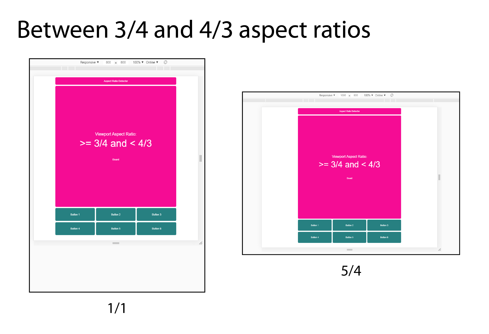
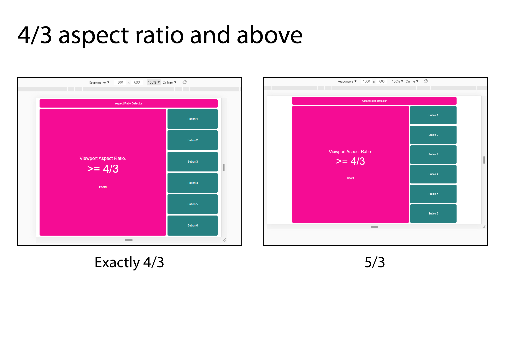

# Aspect-Ratio-Detector

## Try it on [CodeSandbox](https://codesandbox.io/s/github/ChristopherJFoster/Aspect-Ratio-Detector).

### It's easier to resize the app when it's in [its own window](https://h7n89.csb.app).

In this project I'm exploring using media queries to detect and respond to aspect ratio **and** screen size (not just screen width). Designing for different screen widths is a bit simpler, and it obviously works pretty well for scrollable material like paragraphs of text or a series of images. However, there are cases where some elements (perhaps the primary elements) of an app need to be visible at all times. Furthermore, we might want those elements to be as large as possible based on the available screen real estate.

A few of my projects are implementations of games ([Conway's Life](https://github.com/ChristopherJFoster/Conways-Life) and a version of [Battleship](<https://en.wikipedia.org/wiki/Battleship_(game)>) called Sandwich Hunter (in development)). In both cases we need to display a board component and a controls component, and they both need to be visible at all times. My implementation of Life features a square grid, and Battleship already uses square grids, so I'm going to use a square board component in this project.

In this article I'll be discussing the aspect ratios (ARs) of both the viewport/screen **and** the app itself - essential how best to have the latter respond to the former.

## Project goals:

1. Title, Board, and Controls components are always fully visible.
2. App AR is always roughly 3/4 or 4/3.
   - These two ratios cover most use cases while requiring the user to be familiar with at most two app layouts.
3. Title component runs full width of app.
4. Board component is as large as possible while accounting for 2 & 3.
5. Controls component is as large as possible while accounting for 2, 3, & 4.
6. Do not ask users to adjust their viewport or screen to accomodate the app.

Note that it's quite possible to meet some goals while only querying screen width. One would begin by choosing either the 3/4 or 4/3 layout for the app, and then choose one of the following options:

- Ask the user to resize their browser window or reorient their device to better fit the app. This accomplishes goals 1-5 while obviously failing to accomplish goal 6. In some cases it's not possible for a user to adjust the viewport or screen. Furthermore, reshaping the viewport to fit the app clearly doesn't maximize the use of available screen area anyway (see '3/4 app on a 16/9 monitor' in the image below).
- Accept that aspect ratio mismatches will result in large amounts of unused space. This accomplishes goals 1-3 and 6 while failing to accomplish goals 4 and 5.



With a combination of aspect ratio media queries and responsiveness to screen width and height, however, we can achieve all six goals in one design. Below I'll explain my approach to this particular use case, which you can hopefully generalize to other cases.

## The Aspect Ratio Media Query

The [aspect ratio media query](https://developer.mozilla.org/en-US/docs/Web/CSS/@media/aspect-ratio) expects for its value a [ratio](https://developer.mozilla.org/en-US/docs/Web/CSS/ratio) in the form of width/height - where both width and height are positive, unitless integers. Similar to the more commonly used _width_ media query, an AR media query works with either a min, max, or exact value. For example, to apply CSS styles at exactly a 3/4 aspect ratio, we'd use something like:

```css
@media (aspect-ratio: 3/4) {
  background: chartreuse;
}
```

Note that even though 3/4 = 0.75, supplying 0.75 as the aspect ratio is invalid CSS syntax. Note also that if you're using [less](http://lesscss.org/), the compiler will unhelpfully turn that 3/4 into 0.75. The [workaround](https://github.com/less/less.js/issues/3225) is to escape the ratio like so:

```css
@media (aspect-ratio: ~'3/4') {
  background: chartreuse;
}
```

For this project I'm not interested in exact aspect ratios, but in setting up ranges. Specifically, I want the design to respond to aspect ratios in four ranges:

1. < 3/4
2. 3/4 >= & < 1/1
3. 1/1 >= & < 4/3
4. \> 4/3

After some research and tinkering, I learned that the above can be accomplished, simply enough, with the following media queries:

```css
@media (max-aspect-ratio: ~'3/4') {
  [CSS here...]
}
@media (min-aspect-ratio: ~'3/4') and (max-aspect-ratio: ~'1/1') {
  [CSS here, too...]
}
@media (min-aspect-ratio: ~'1/1') and (max-aspect-ratio: ~'4/3') {
  [CSS here, also...]
}
@media (min-aspect-ratio: ~'4/3') {
  [CSS here, as well...]
}
```

If you've noticed that in the code above multiple rules apply when the aspect ratio is _exactly_ 3/4, 1/1, or 4/3, then good for you for paying attention. If you caught that, then you may already know that CSS rules are applied in order, and that the last rule (in the last stylesheet, if the rule appears in multiple stylesheets) will prevail. Thus an exact 3/4 aspect ratio would have the second set of rules applied, an exact 1/1 would have the third set of rules applied, and so on. Note that this means you should be careful if you use overlapping aspect ratio media queries in multiple places in your CSS. In most cases, I imagine, you'd want to make sure that your ranges of aspect ratios are in the same order each time you use them.

So now we can apply CSS rules selectively based on the detected aspect ratio of the viewport/screen. This alone is a useful feature to understand, but it isn't enough to meet all six goals outlined earlier - we still need to the app to respond to screen size.

## Responsiveness to either screen width _or_ height

Since I'm aiming for the board and controls components to be as large as possible given the screen size and aspect ratio (goals 4 & 5)—while maintaining a 1/1 aspect ratio for the board component—I'm going to have get to my hands dirty with careful calculations and responsive units for each aspect ratio range.

### Screen aspect ratio: < 3/4 range

I'll start with the `< 3/4` range. In this project the App component is the container for the other components, and I set its width and height based first on the aspect ratio of viewport/screen. For `< 3/4`, I use the following code (`display: grid` and the `grid-area` assignments are not shown):

```css
@media (max-aspect-ratio: ~'3/4') {
  width: 100vw;
  height: 130vw;
  grid-template-columns: 1fr 98fr 1fr;
  grid-template-rows: 1fr 6fr 1fr 98fr 1fr 22fr 1fr;
  grid-template-areas:
    '. . .'
    '. title .'
    '. . .'
    '. board .'
    '. . .'
    '. controls .'
    '. . .';
}
```

> (src/less/App.less)

`vw`, if you're not familiar, is a [CSS viewport unit](https://developer.mozilla.org/en-US/docs/Web/CSS/length) corresponding to 1% of the width of the viewport. 100vw, therefore, sets the width to 100% of the width of the viewport, while 130vw sets the height to 130% of the width of the viewport. Together, these style the App container component to have (roughly) a 3/4 aspect ratio that is as large as possible based on the viewport width (true 3/4 would have a height of 133.333...vw. I rounded to 130 to make it easier to distribute the available space to the subcomponents and to avoid the inexact rendering borne of a repeating decimal).



> So far so good: at a 5/8 ratio there is unused space, but given that the board component must be square, it can't be any larger than it is.

### Screen aspect ratio: 3/4 >= & < 1/1

Finally we have the middle range - from 3/4 to 4/3. One might call it the square-ish range, as it starts as a rectangle that is taller than it is wide, transitions to a square, and then ends as a rectangle that is wider than it is tall. The approach I've taken to the app's layout in this range is to keep the layout from the 'up to 3/4' range, but of course have it scale properly. This means that other than width and height, the CSS inside the 'up to 3/4' and 'from 3/4 to 4/3' media queries is identical (I'm sure there's a clever way not to repeat that code, but I went for explicit over DRY). So really the only puzzle here is how to style the aspect ratio of the container to be the same as the 'up to 3/4' range while being as large as possible based on the viewport/screen. I found the following dimensions to work best:

```css
width: 75vh;
height: 97.5vh;
```

You might notice that 75x97.5 is the same ratio as 100x130 - it's just been reduced by 25%. My first instinct was to try a height of 100vh (just as the width had been 100vw), so I started with 76.92307vhx100vh. This worked well _except_ right around the transition from the lowest range of aspect ratios to this range. Basically the App container was too wide just after the transition (and then the problem cleared up once the aspect ratio was slightly larger). 75vhx97.5 was just my first attempt to try a narrower width - and it happened to make a nicer set of numbers as well. You can [play around with the aspect ratio](https://h7n89.csb.app/) and you should see that it transitions fairly seamlessly between 'up to 3/4' and 'from 3/4 to 4/3'.



> A square viewport/screen isn't ideal for this app, but then again, there are very few, if any, square screens (and the board couldn't be any larger anyway). The 5/4 ratio is close to the worst case scenario - it the app was in its 4/3 orientation it would use much more of the screen real estate.

### 4/3 and above

I'm going to save the middle ranges (3/4 to 4/3) for last since it's the most complex. Moving to the '4/3 and above' range, there is a symmetry with the 'up to 3/4' range that makes the CSS easy to understand:

```css
width: 130vh;
height: 100vh;
```

"vh" is the viewport unit for height, so at 4/3 aspect ratio and above, the App container itself has close to a 4/3 aspect ratio. The Controls component that used to be below the square Board component is now to the right. I also use aspect ratio media queries in Controls.less to style the buttons in a 1x6 matrix rather than a 3x2 matrix.



> As with 3/4, we have optimal use of the available space as the ratio approaches 4/3. At 5/3 we can see that there is again unused space, but that the square board is as large as it can be given the constraints.

## Conclusion / Notes

There is more to know about aspect ratio media queries than I discuss here, but if you're new to them, I hope I've provided a useful introduction. Though the use case I've explored is pretty specific, I think it's simple enough to be applied to other cases. If you've learned something, spotted an error, or if I've saved you a bit of effort in solving a similar puzzle, let me know in the comments.
